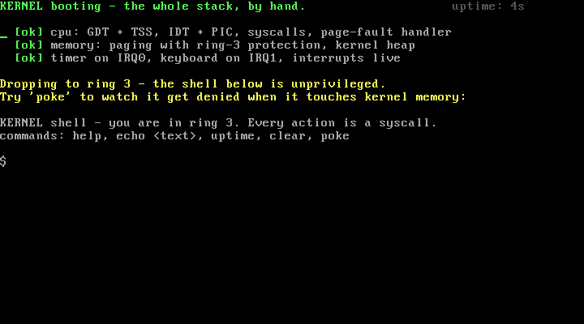

# 🖥️ KERNEL

**A complete x86 operating system, written from scratch in C and assembly — and it boots in your browser.**

### ▶ [Live demo — mikebertin.github.io/kernel](https://mikebertin.github.io/kernel/)

Click the screen, type `help`, then try `poke` and watch the CPU deny it.



No Linux, no libraries, no framework underneath. A hand-written boot sector
starts the machine in 16-bit real mode and climbs, one layer at a time, all the
way to several **isolated user processes** running unprivileged in ring 3, each
in its own address space. The **same disk image** runs in QEMU and — via
[v86](https://github.com/copy/v86), an x86 emulator compiled to WebAssembly —
live in a browser tab.

## What's inside

Built bottom-up, every layer by hand:

| Layer | What it does |
|-------|--------------|
| **Boot** | A 512-byte boot sector: real mode → 32-bit protected mode by hand (GDT, A20 line, `CR0.PE`), then into C. |
| **Interrupts** | An IDT, a remapped 8259 PIC, a PIT timer (IRQ0) and a PS/2 keyboard driver (IRQ1). |
| **Virtual memory** | A physical frame allocator, two-level paging, and a `kmalloc`/`kfree` kernel heap. |
| **Multitasking** | A pre-emptive round-robin scheduler with real context switches on every timer tick. |
| **Userspace** | Ring 3 (GDT + TSS), `int 0x80` system calls — user code can only reach the kernel through the syscall gate. |
| **Isolation** | Every process has its **own address space** (its own page directory); `CR3` is swapped on each context switch, so processes cannot see each other's memory — the same virtual address maps to a different physical frame per process. |
| **Protection** | Kernel memory is supervisor-only; a ring-3 access violation raises a page fault the kernel catches, reports, and stops on. |

The [live demo](https://mikebertin.github.io/kernel/) pairs the running OS with an
annotated walkthrough of the **actual kernel source** for each of these pieces.

## Try it

**In your browser** — open the [live demo](https://mikebertin.github.io/kernel/).
Watch three user processes run at once, pre-empted by the timer. Each reads the
*same* virtual address (`0xB0000000`) yet it maps to a *different* physical frame
per process — visible proof they're truly isolated address spaces.

**Locally, in QEMU:**

```sh
# toolchain (macOS): brew install i686-elf-gcc nasm qemu
make          # build build/os-image.bin
make run      # boot it in QEMU
```

Other targets: `make screenshot` (headless PNG of the screen), `make debug`
(QEMU waiting for GDB on `:1234`), `make web` (stage the image for the browser
demo).

## How it's laid out

| Path | What |
|------|------|
| `boot/boot.asm` | boot sector: real mode → load the kernel off disk → protected mode |
| `kernel/*.c`, `kernel/*.asm` | the kernel — interrupts, memory, scheduler, syscalls, shell, fault handling |
| `linker.ld` | flat layout: `_start` at `0x10000`, plus the isolated `.user_text` user-mode section |
| `web/` | the in-browser demo (v86) and the annotated source walkthrough |

- 32-bit i686, freestanding C (`-ffreestanding`, no standard library) + NASM assembly.
- Built with an `i686-elf` cross-compiler; runs identically on QEMU and v86.

## Why build this?

To remove the last abstraction. Writing an OS by hand is the way to actually
understand what a process is, what memory management costs, why a context switch
is expensive, and what a system call really does — not as concepts, but as code
you can point at. The aim was to end up with no black boxes left below the C.

## License

[MIT](LICENSE) — do whatever you like with it.
